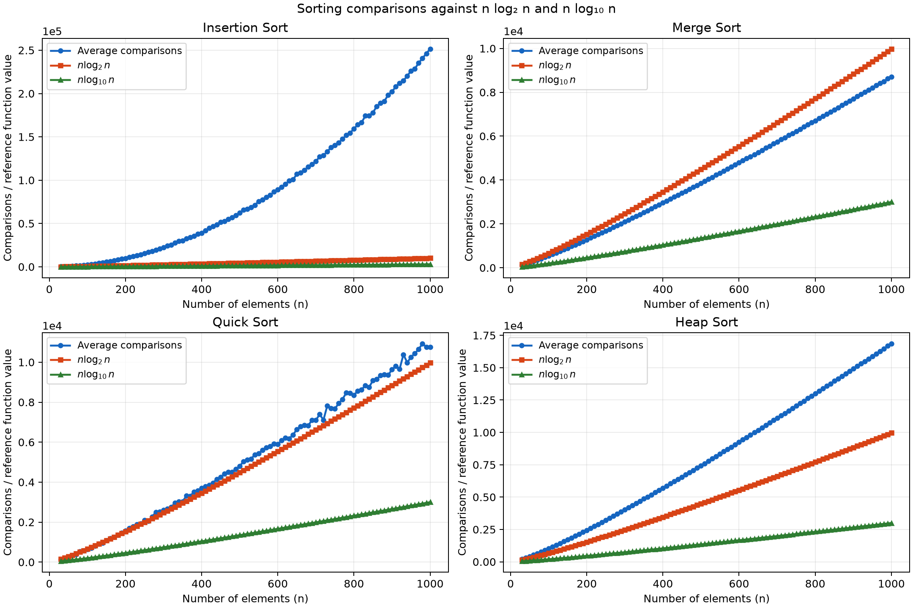

# Sorting Algorithms: Lab Results

## Experiment setup

- Comparison inputs: rand() % 1000, allowing duplicates; srand(20261005) for reproducibility.
- Sizes: 30 through 1000 inclusive, in steps of 10; ten trials per size (98 sizes).
- The exact same inputs are generated for each comparison algorithm on this build.
- Insertion follows the supplied INSERTION.CPP: increment only inside the shifting loop. This counts successful comparisons/shifts and excludes failed value comparisons.
- Merge, quick and heap count each executed value comparison, including false outcomes. These counters therefore use a different convention from the supplied insertion example.
- Average comparisons = total recorded counter across ten trials / 10.
- Timing: steady_clock, expressed in milliseconds, with a warmup before each case.
- Input creation, copying, validation and printing are outside the timed region.
- Memory allocation required by a sorting algorithm is inside the timed region.
- Sorting is checked against the complete expected output after every measured run.

## Average comparisons

| n | Insertion | Merge | Quick | Heap | n log₂ n | n log₁₀ n |
|---:|---:|---:|---:|---:|---:|---:|
| 30 | 216.50 | 109.80 | 123.30 | 205.20 | 147.21 | 44.31 |
| 40 | 390.90 | 166.00 | 195.50 | 307.90 | 212.88 | 64.08 |
| 50 | 618.60 | 221.60 | 261.50 | 414.70 | 282.19 | 84.95 |
| 60 | 835.50 | 282.40 | 345.10 | 529.60 | 354.41 | 106.69 |
| 70 | 1,235.20 | 343.10 | 385.90 | 645.50 | 429.05 | 129.16 |
| 80 | 1,560.60 | 407.90 | 531.50 | 769.80 | 505.75 | 152.25 |
| 90 | 2,026.70 | 475.70 | 583.30 | 899.90 | 584.27 | 175.88 |
| 100 | 2,490.00 | 540.50 | 640.60 | 1,025.60 | 664.39 | 200.00 |
| 110 | 2,845.30 | 611.50 | 701.60 | 1,160.50 | 745.95 | 224.55 |
| 120 | 3,508.40 | 678.00 | 799.40 | 1,288.30 | 828.83 | 249.50 |
| 130 | 4,329.20 | 748.90 | 919.90 | 1,422.00 | 912.91 | 274.81 |
| 140 | 5,052.00 | 826.10 | 965.70 | 1,570.40 | 998.10 | 300.46 |
| 150 | 5,598.90 | 897.00 | 1,079.70 | 1,708.20 | 1,084.32 | 326.41 |
| 160 | 6,442.40 | 974.80 | 1,187.90 | 1,856.10 | 1,171.51 | 352.66 |
| 170 | 7,217.80 | 1,049.30 | 1,259.40 | 2,009.30 | 1,259.60 | 379.18 |
| 180 | 8,187.20 | 1,125.50 | 1,368.40 | 2,148.80 | 1,348.53 | 405.95 |
| 190 | 9,189.20 | 1,204.60 | 1,456.00 | 2,303.30 | 1,438.27 | 432.96 |
| 200 | 9,832.70 | 1,280.00 | 1,578.80 | 2,449.20 | 1,528.77 | 460.21 |
| 210 | 11,042.30 | 1,361.00 | 1,690.50 | 2,605.90 | 1,619.99 | 487.67 |
| 220 | 12,177.40 | 1,440.60 | 1,776.60 | 2,761.20 | 1,711.90 | 515.33 |
| 230 | 13,194.90 | 1,514.50 | 1,889.50 | 2,901.50 | 1,804.46 | 543.20 |
| 240 | 13,928.40 | 1,596.10 | 1,925.10 | 3,061.20 | 1,897.65 | 571.25 |
| 250 | 15,648.30 | 1,680.50 | 2,102.70 | 3,213.20 | 1,991.45 | 599.49 |
| 260 | 17,224.60 | 1,757.70 | 2,052.10 | 3,374.80 | 2,085.82 | 627.89 |
| 270 | 18,012.90 | 1,846.00 | 2,276.80 | 3,539.30 | 2,180.74 | 656.47 |
| 280 | 19,518.00 | 1,928.00 | 2,500.80 | 3,693.70 | 2,276.20 | 685.20 |
| 290 | 20,764.20 | 2,007.80 | 2,524.60 | 3,858.40 | 2,372.17 | 714.10 |
| 300 | 22,460.50 | 2,096.10 | 2,597.60 | 4,022.80 | 2,468.65 | 743.14 |
| 310 | 24,281.30 | 2,181.20 | 2,675.20 | 4,187.90 | 2,565.60 | 772.32 |
| 320 | 25,167.30 | 2,269.30 | 2,748.40 | 4,361.40 | 2,663.02 | 801.65 |
| 330 | 27,550.90 | 2,346.50 | 2,964.20 | 4,521.40 | 2,760.89 | 831.11 |
| 340 | 29,734.70 | 2,435.70 | 3,020.70 | 4,681.00 | 2,859.19 | 860.70 |
| 350 | 30,093.90 | 2,524.60 | 3,032.30 | 4,870.10 | 2,957.92 | 890.42 |
| 360 | 32,611.40 | 2,610.70 | 3,319.40 | 5,021.60 | 3,057.07 | 920.27 |
| 370 | 34,003.70 | 2,702.50 | 3,312.30 | 5,182.50 | 3,156.61 | 950.23 |
| 380 | 35,455.10 | 2,784.60 | 3,505.90 | 5,371.60 | 3,256.55 | 980.32 |
| 390 | 38,143.20 | 2,867.10 | 3,582.30 | 5,528.80 | 3,356.86 | 1,010.52 |
| 400 | 39,182.30 | 2,961.20 | 3,699.60 | 5,710.00 | 3,457.54 | 1,040.82 |
| 410 | 42,013.50 | 3,047.70 | 3,787.20 | 5,868.60 | 3,558.59 | 1,071.24 |
| 420 | 44,658.80 | 3,133.10 | 3,845.50 | 6,040.70 | 3,659.98 | 1,101.76 |
| 430 | 46,554.70 | 3,229.90 | 3,963.10 | 6,218.50 | 3,761.72 | 1,132.39 |
| 440 | 48,723.80 | 3,318.10 | 4,156.00 | 6,385.80 | 3,863.80 | 1,163.12 |
| 450 | 51,826.60 | 3,402.80 | 4,242.70 | 6,551.20 | 3,966.20 | 1,193.95 |
| 460 | 52,529.30 | 3,496.60 | 4,416.20 | 6,733.70 | 4,068.93 | 1,224.87 |
| 470 | 55,052.80 | 3,587.90 | 4,498.20 | 6,901.40 | 4,171.96 | 1,255.89 |
| 480 | 57,077.10 | 3,672.40 | 4,504.60 | 7,078.70 | 4,275.31 | 1,287.00 |
| 490 | 59,345.00 | 3,757.90 | 4,662.40 | 7,256.70 | 4,378.95 | 1,318.20 |
| 500 | 62,225.50 | 3,855.90 | 4,793.50 | 7,417.20 | 4,482.89 | 1,349.49 |
| 510 | 65,875.10 | 3,946.10 | 5,042.90 | 7,595.50 | 4,587.12 | 1,380.86 |
| 520 | 66,770.40 | 4,037.40 | 5,127.90 | 7,772.90 | 4,691.63 | 1,412.32 |
| 530 | 68,886.90 | 4,130.70 | 5,167.70 | 7,969.40 | 4,796.42 | 1,443.87 |
| 540 | 71,265.50 | 4,228.60 | 5,380.40 | 8,145.90 | 4,901.48 | 1,475.49 |
| 550 | 75,624.10 | 4,321.00 | 5,438.60 | 8,328.50 | 5,006.81 | 1,507.20 |
| 560 | 77,677.20 | 4,412.00 | 5,613.10 | 8,518.90 | 5,112.40 | 1,538.99 |
| 570 | 80,316.20 | 4,511.50 | 5,732.00 | 8,697.90 | 5,218.25 | 1,570.85 |
| 580 | 82,580.90 | 4,608.60 | 5,803.50 | 8,867.50 | 5,324.35 | 1,602.79 |
| 590 | 86,522.30 | 4,692.70 | 5,917.10 | 9,062.90 | 5,430.70 | 1,634.80 |
| 600 | 89,255.70 | 4,796.60 | 5,891.60 | 9,253.00 | 5,537.29 | 1,666.89 |
| 610 | 92,171.50 | 4,885.70 | 6,090.70 | 9,443.60 | 5,644.13 | 1,699.05 |
| 620 | 95,287.70 | 4,989.00 | 6,206.40 | 9,624.10 | 5,751.20 | 1,731.28 |
| 630 | 99,226.90 | 5,068.60 | 6,176.40 | 9,818.10 | 5,858.50 | 1,763.58 |
| 640 | 100,601.60 | 5,167.90 | 6,368.90 | 9,991.80 | 5,966.03 | 1,795.96 |
| 650 | 106,941.90 | 5,267.10 | 6,637.20 | 10,166.50 | 6,073.79 | 1,828.39 |
| 660 | 108,764.30 | 5,361.00 | 6,780.80 | 10,356.60 | 6,181.77 | 1,860.90 |
| 670 | 111,626.50 | 5,462.40 | 6,853.40 | 10,565.10 | 6,289.97 | 1,893.47 |
| 680 | 115,469.40 | 5,553.20 | 6,830.80 | 10,743.40 | 6,398.39 | 1,926.11 |
| 690 | 118,318.70 | 5,654.80 | 7,113.50 | 10,940.80 | 6,507.01 | 1,958.81 |
| 700 | 121,591.20 | 5,745.60 | 7,099.80 | 11,128.00 | 6,615.85 | 1,991.57 |
| 710 | 127,228.10 | 5,849.70 | 7,391.10 | 11,295.40 | 6,724.89 | 2,024.39 |
| 720 | 128,525.00 | 5,931.50 | 7,111.80 | 11,477.80 | 6,834.13 | 2,057.28 |
| 730 | 133,014.80 | 6,044.10 | 7,827.40 | 11,673.60 | 6,943.58 | 2,090.23 |
| 740 | 137,798.50 | 6,131.90 | 7,698.00 | 11,872.80 | 7,053.22 | 2,123.23 |
| 750 | 140,412.50 | 6,218.70 | 7,676.90 | 12,065.10 | 7,163.06 | 2,156.30 |
| 760 | 143,276.10 | 6,325.60 | 7,937.90 | 12,246.70 | 7,273.09 | 2,189.42 |
| 770 | 147,594.10 | 6,436.70 | 8,147.40 | 12,428.50 | 7,383.31 | 2,222.60 |
| 780 | 151,876.60 | 6,531.40 | 8,473.80 | 12,632.80 | 7,493.72 | 2,255.83 |
| 790 | 154,547.50 | 6,626.90 | 8,447.50 | 12,815.20 | 7,604.31 | 2,289.13 |
| 800 | 159,330.40 | 6,711.70 | 8,356.40 | 13,007.30 | 7,715.08 | 2,322.47 |
| 810 | 163,966.50 | 6,808.40 | 8,560.00 | 13,191.10 | 7,826.04 | 2,355.87 |
| 820 | 166,430.60 | 6,913.00 | 8,629.70 | 13,387.40 | 7,937.17 | 2,389.33 |
| 830 | 174,262.80 | 7,017.90 | 8,836.40 | 13,591.40 | 8,048.48 | 2,422.83 |
| 840 | 174,294.80 | 7,107.60 | 8,757.40 | 13,769.50 | 8,159.97 | 2,456.39 |
| 850 | 178,078.60 | 7,206.70 | 9,087.50 | 13,967.40 | 8,271.62 | 2,490.01 |
| 860 | 185,255.60 | 7,306.50 | 9,155.20 | 14,162.10 | 8,383.45 | 2,523.67 |
| 870 | 188,942.60 | 7,407.20 | 9,336.30 | 14,342.10 | 8,495.44 | 2,557.38 |
| 880 | 191,205.60 | 7,513.00 | 9,393.10 | 14,543.40 | 8,607.60 | 2,591.14 |
| 890 | 198,520.50 | 7,610.50 | 9,358.00 | 14,730.60 | 8,719.92 | 2,624.96 |
| 900 | 202,280.20 | 7,704.20 | 9,634.00 | 14,914.70 | 8,832.40 | 2,658.82 |
| 910 | 207,876.80 | 7,818.40 | 9,808.20 | 15,114.60 | 8,945.05 | 2,692.73 |
| 920 | 212,165.00 | 7,909.40 | 9,661.70 | 15,313.20 | 9,057.85 | 2,726.68 |
| 930 | 214,891.20 | 8,009.80 | 10,382.90 | 15,500.30 | 9,170.81 | 2,760.69 |
| 940 | 220,224.40 | 8,108.30 | 9,983.80 | 15,694.70 | 9,283.93 | 2,794.74 |
| 950 | 226,298.90 | 8,209.20 | 10,258.30 | 15,879.50 | 9,397.19 | 2,828.84 |
| 960 | 228,513.70 | 8,311.30 | 10,438.50 | 16,076.30 | 9,510.61 | 2,862.98 |
| 970 | 235,386.50 | 8,410.20 | 10,652.80 | 16,272.80 | 9,624.19 | 2,897.17 |
| 980 | 240,525.50 | 8,501.60 | 10,929.20 | 16,461.00 | 9,737.91 | 2,931.40 |
| 990 | 246,277.50 | 8,618.10 | 10,766.00 | 16,678.00 | 9,851.77 | 2,965.68 |
| 1000 | 251,191.50 | 8,709.10 | 10,764.70 | 16,858.80 | 9,965.78 | 3,000.00 |

Insertion sort grows quadratically on these random arrays. Merge, quick and heap sort show the expected n log n average growth. The two logarithmic reference curves differ only by a constant factor: n log₂ n is about 3.322 times n log₁₀ n. They are reference functions, not exact predictions of an algorithm's comparison count.

## Insertion sort: 15,000 elements

| Case | Input order | Trials | Mean time (ms) |
|---|---|---:|---:|
| Best | Ascending | 5 | 0.006475 |
| Average | Fresh random permutation per trial | 5 | 22.889134 |
| Worst | Descending | 5 | 38.572533 |

The best case runs in O(n); the average and worst cases run in O(n²). Under the supplied shift-count convention, the best case records 0 and the reverse-sorted distinct worst case records n(n − 1)/2. The separate timing implementation does not maintain a counter.

## Radix, bucket and counting sort

| Algorithm | Elements | Trials | Mean time (ms) |
|---|---:|---:|---:|
| Radix Sort | 25 | 1000 | 0.000291 |
| Bucket Sort | 25 | 1000 | 0.000574 |
| Counting Sort | 25 | 1000 | 0.000884 |

Each program sorts 25 elements. Radix and counting sort use the same integer input. Bucket sort uses those values divided by 1000, to satisfy its [0, 1) input domain. Inputs and sorted outputs appear in the README and in program output.

These tiny timings are machine-specific and include timer overhead. Averaging 1,000 runs reduces noise, but the results do not establish a general speed ranking.

## Validation and limitations

- All eight programs compile with C++17, -O2, -Wall, -Wextra and -Wpedantic.
- Correctness tests cover all permutations through seven elements for the four comparison sorts, random duplicate-heavy inputs, empty and singleton arrays, and integer extremes.
- Tests verify independent exact comparison counts and rejection of unsupported noncomparison inputs.
- AddressSanitizer and UndefinedBehaviorSanitizer checks passed on the submitted implementation.
- This report generator verifies every saved average against the raw CSV trials, and verifies both reference formulas.
- The comparison setup and insertion counter match the supplied INSERTION.CPP. A fixed-capacity array replaces its nonstandard variable-length array; a fixed random seed makes the saved results reproducible.
- rand() sequences can differ between C library implementations; the seed reproduces comparison inputs on the same implementation.
- Quick sort uses ordinary recursion and a last-element pivot; sorted or equal inputs can take O(n²) time and O(n) recursion depth.
